# AlgoWithMe

     
        
     

## 목차
- [서비스 개요](#서비스-개요)
- [팀원소개](#팀원소개)
- [기술스택](#기술스택)
- [시스템 아키텍쳐](#시스템-아키텍쳐)
- [기능소개](#기능소개)
- [프로젝트 산출물](#프로젝트-산출물)

 

## 서비스 개요
AlgoWithMe는 온라인 알고리즘 스터디 플랫폼입니다. 사용자는 문제를 풀고, 동료에게 피드백을 받으며 메모와 정리를 동시에 진행할 수 있습니다. 또한, 소스코드를 GitHub에 자동 업로드할 수 있습니다. 문제 선정, 풀이, 코드 리뷰, 사후 코드 관리 및 복습에 이르기까지, 알고리즘 스터디의 AtoZ를 통합 관리하는 플랫폼입니다.

## 팀원소개

<table>
    <tr>
        <td height="140px" align="center"> <a href="https://github.com/JangMinSeong">
                ✨ 장민성  (Front-End) </a>  </td>
        <td height="140px" align="center"> <a href="https://github.com/Hyaanu">
                🌻 조현우  (Front-End) </a>  </td>
        <td height="140px" align="center"> <a href="https://github.com/jiyeon2536">
                🤿 김지연  (Front-End) </a>  </td>
        <td height="140px" align="center"> <a href="https://github.com/choe-jaeseong">
                🐈‍ 최재성  (Back-End) </a>  </td>
        <td height="140px" align="center"> <a href="https://github.com/soungjin">
                🎮 박성진  (Back-End) </a>  </td>
        <td height="140px" align="center"> <a href="https://github.com/sarang682">
                🛌 박사랑  (Back-End) </a>  </td>
    </tr>
</table>

## 기술스택

### 프론트앤드

 

**Language |** HTML5, CSS3, JavaScript, node.js(v20.12.10)

**Framework |** React.js(v18.2.0), Redux Toolkit(v2.2.3), Vite(v5.2.0)

**Library |** ESLINT(v8.57.0), PRETTIER, TAILWIND(v3.4.3), TYPESCRIPT(v5.2.2), YSJ(13.6.14), OPENVIDU(2.29.1), TIPTAP(2.3.0), ACEEDITOR(11.0.1), STOMP(2.3.3), WEBSOCKET(8.17.0)

 
 

### 백앤드 

 

 

**Language |** Java 21

**Framework |** Spring Boot 3.2.3

**DB Connection(ORM) |** Spring Data JPA

**Build Tool |** Gradle

 
 

### 컴파일러 서버

 

**Language |** Python 3.12

**Framework |** FastAPI 0.110.0

**Library |** cppyy

 

### 인프라

 

**DB |** mariaDB, MongoDB

**Server |** GitLab, Jenkins, Docker, Nginx

 
 

### Development Tools 

  

## 시스템 아키텍쳐

   
  
   

# 기능소개
1. 메인화면

2. 로그인

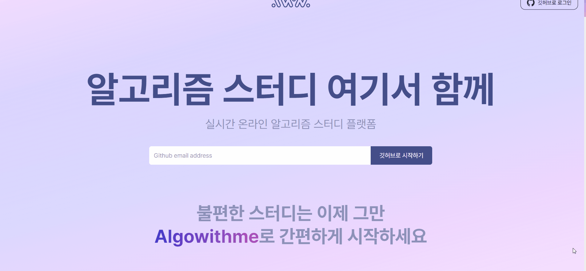

3. 페이지 검색

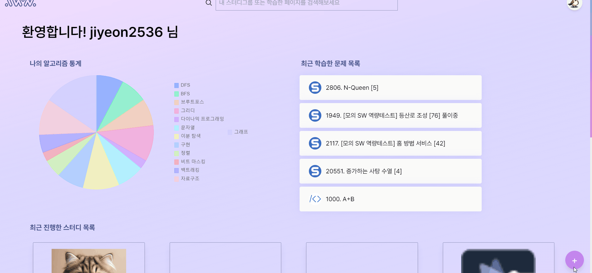

4. 사용자 초대

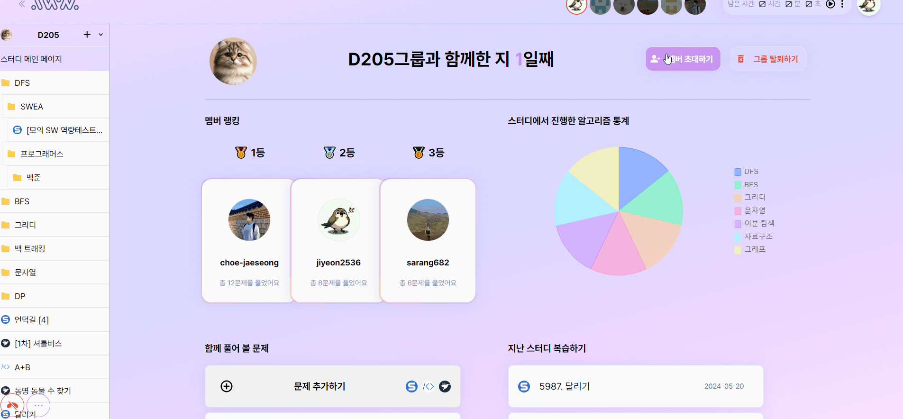

5. 새로운 문제 추가

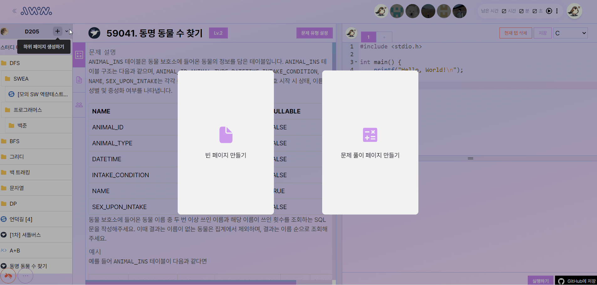

6. 화면 크기 조정

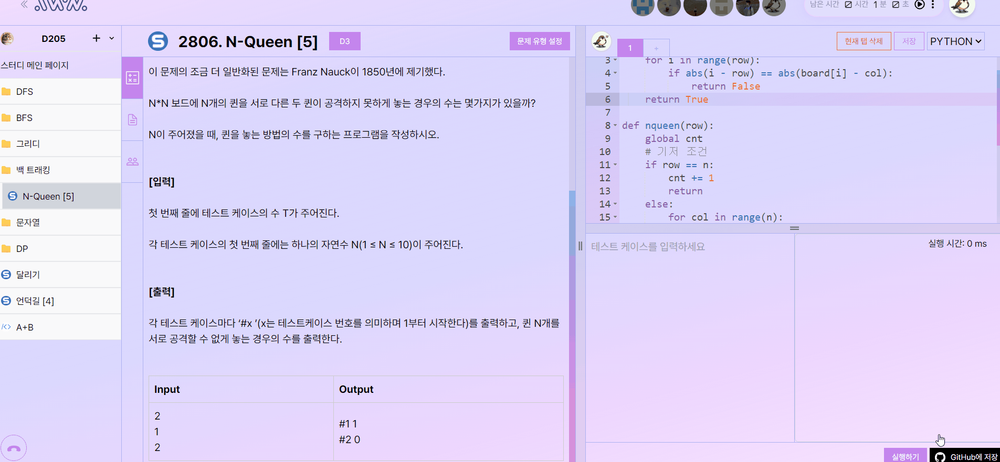

7. 문제 풀이 타이머 설정

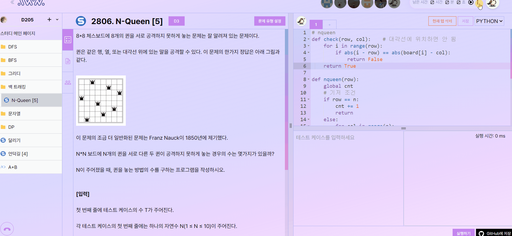

8. 음성 채팅

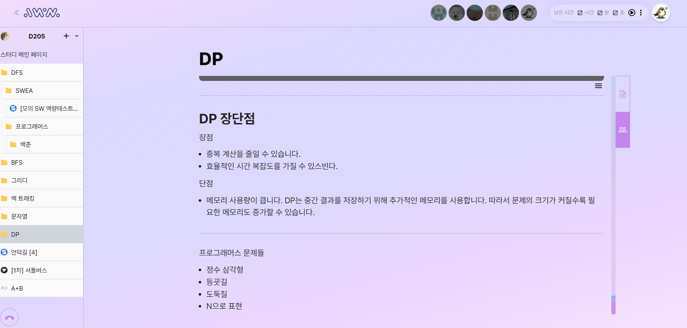

9. 공용 메모 공간

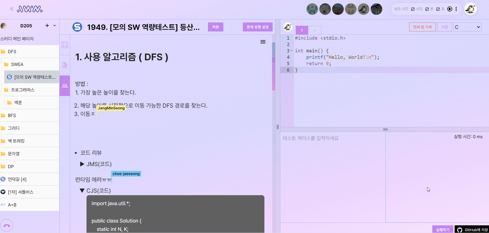

10. 마크다운

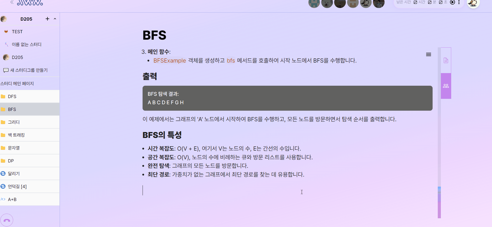

11. 코드 자동 완성

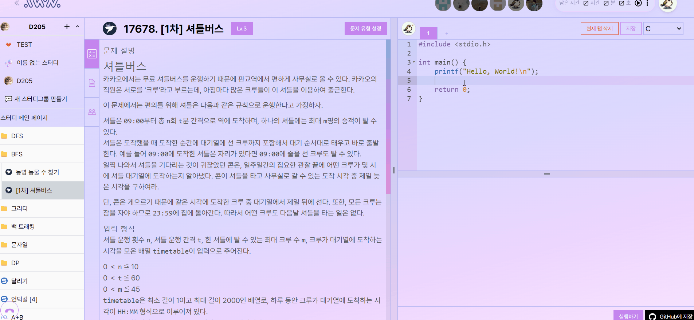

12. 그룹원 코드 보기

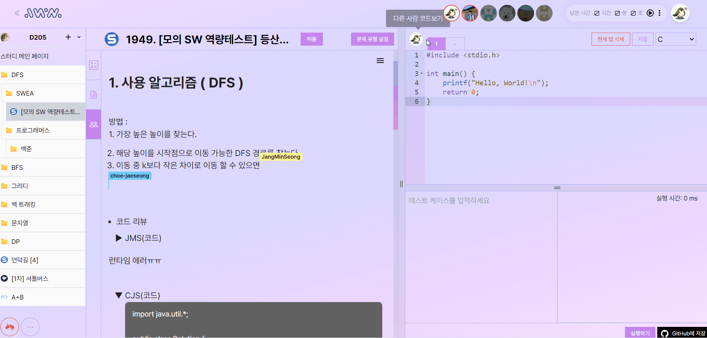

13. 코드 실행하기

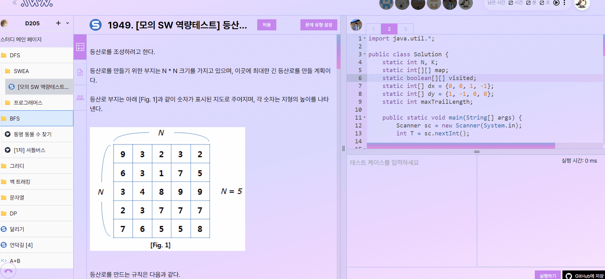

14. 깃 저장하기

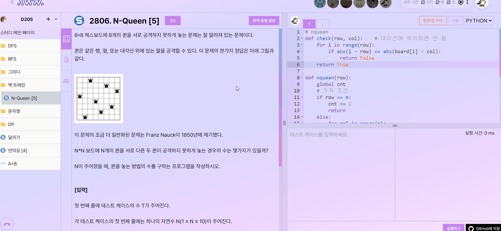

15. 폴더 구조 변경

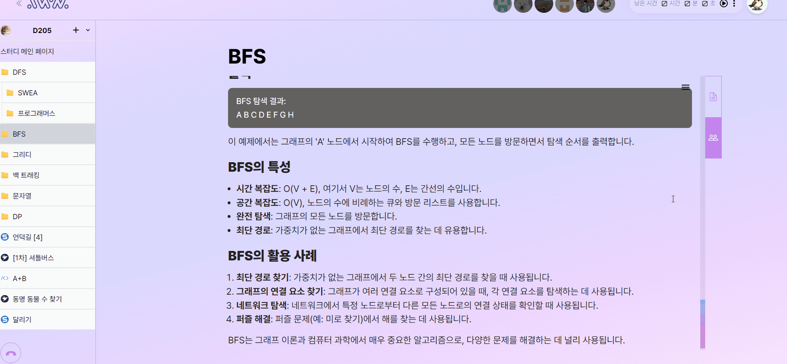

## 프로젝트 산출물

- API 명세서

    - <a href="https://www.notion.so/API-ce93840e94da44e4a6da3066c83f86aa">📜 Notion API 명세서</a>

- ERD Schema

    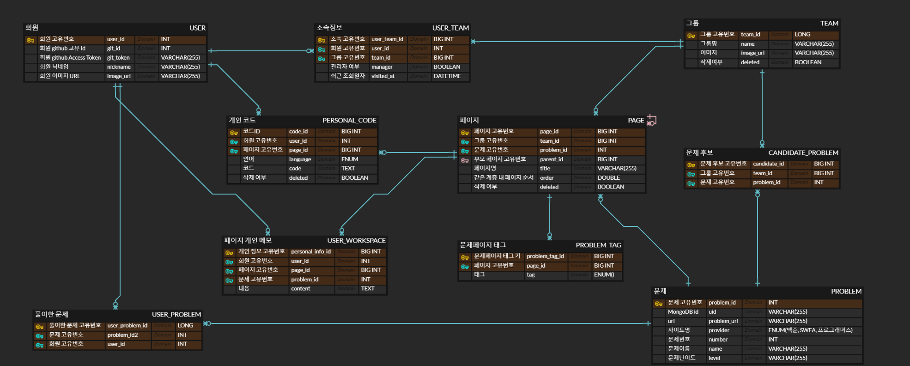

- 와이어프레임

    - <a href ="https://www.figma.com/design/qDLuW2l0W0Nq7jp8HJyRIB/D205?node-id=179446%3A10039&t=RzBNo4OSZYUdV0og-1">🎨 Figma</a>
